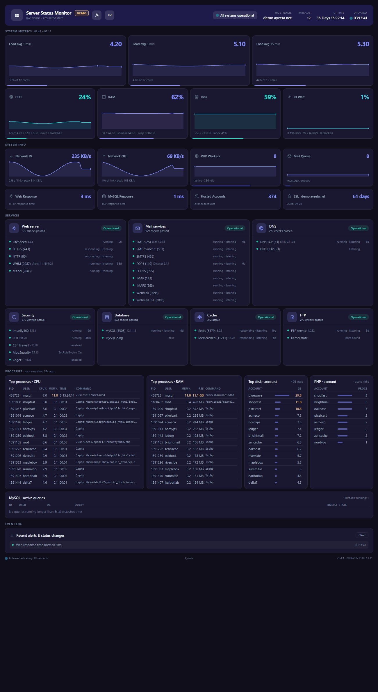
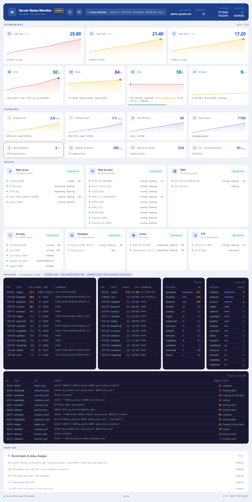
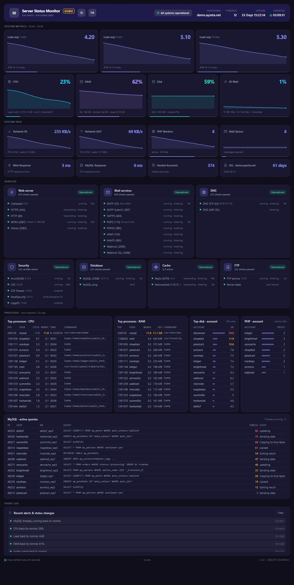
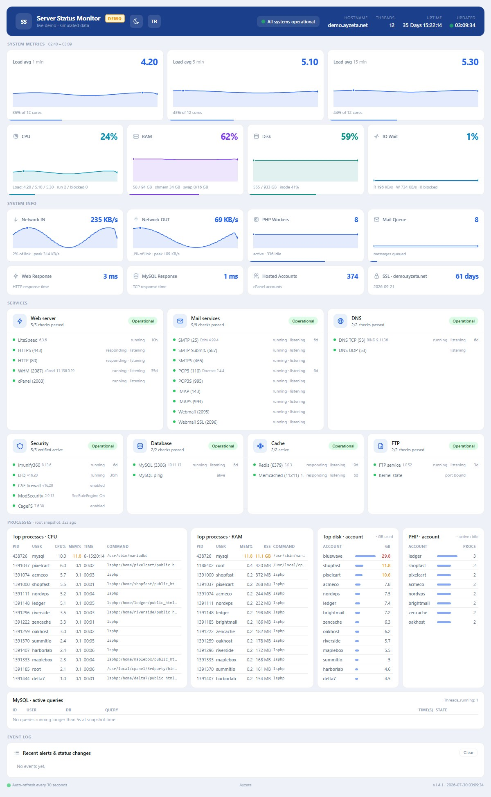
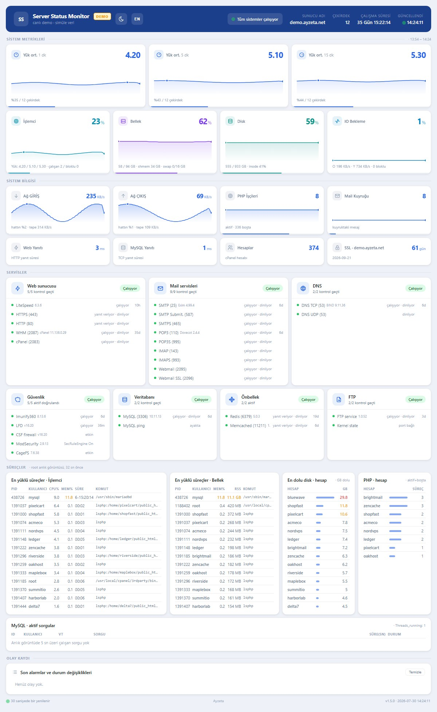

# Server Status Monitor

A single-file, real-time infrastructure dashboard for **cPanel** servers
(CloudLinux optional — its CageFS / LVE / Imunify signals are auto-detected when
present). Load, CPU, RAM, disk, IO wait, network saturation, RAID/SMART health,
services, top processes, per-account disk & PHP workers, and a live event log —
all on one auto-refreshing page, with **zero dependencies** (no database, no npm,
no external services).



**▶ [Live demo](https://ayzeta.github.io/server-status-monitor/)** — a self-contained
simulation (no backend): watch traffic climb, PHP workers and load rise, cards go
red, backup / ImunifyAV / WP-Toolkit jobs run, a MySQL query pileup hit, RAID/SMART/
inode/mail-queue warnings fire into the event log, then the server recover — on a loop.

Almost everything is computed by the page itself. The one exception: a tiny
**root cron collector** gathers what the web-account PHP can't reach on its own —
the full process list, `/sys`, SMART/RAID — and hands it to the dashboard once a
minute. (That PHP is unprivileged: jailed under CageFS on CloudLinux, or otherwise
barred from other users' processes.)

> The page also renders as a **static HTML email** (e.g. CSF's high-load alert
> attachment): every alarm is server-rendered, and no output line exceeds the
> SMTP 900-byte limit.

**Version 1.1.0** · bilingual UI — English (default) / Türkçe, switched from the
header button (per-browser, cookie-based). The version shows in the footer.

## Screenshots

<table width="100%">
  <tr>
    <td width="50%"></td>
    <td width="50%"></td>
  </tr>
  <tr>
    <td align="center"><b>Issues detected</b> — MySQL threads_running spike, red cards, offenders in the header</td>
    <td align="center"><b>Recovery</b> — the same server back to green, event log tracing what happened</td>
  </tr>
  <tr>
    <td width="50%"></td>
    <td width="50%"></td>
  </tr>
  <tr>
    <td align="center"><b>Light · English</b> (default)</td>
    <td align="center"><b>Light · Türkçe</b></td>
  </tr>
</table>

---

## Features

- **Unified health model** — one status in the header (`All systems operational`
  / `Degraded` / `Issues detected`) aggregated from *every* metric and service,
  with the actual offenders listed inline. Tab title + favicon reflect it too.
- **Proportional thresholds** — load is scaled to core count, CPU/RAM/disk are
  percentages, network is % of link speed. Sensible on any server, not tuned to
  one box.
- **Network line saturation** — each interface measured against its own link
  speed (max, not sum), so an idle NIC never masks a saturated one.
- **RAID / SMART / inode / mismatch** alarms, shown on the disk card *and* the
  event log (mail-safe).
- **Live event log** with 2-tick confirmation (no flapping) + server-seeded
  history from the last 30 minutes.
- **Mobile-friendly** and **light/dark** aware.
- **Drop-in for CSF & WHMCS** — works as CSF's high-load status page on LiteSpeed
  servers (which have no Apache `mod_status`) and as a WHMCS *Server Status*
  endpoint. See [Integrations](#integrations).

## Requirements

- A cPanel server; root access for the cron collector. CloudLinux is optional —
  its CageFS / LVE / Imunify signals are auto-detected when present.
- PHP 7.4+ served for the web account (defaults work; no extensions required
  beyond `posix` for user auto-detect).
- Optional tools are feature-detected: `smartctl`, `mdadm`/`/proc/mdstat`,
  `imunify360-agent`, `csf`, `repquota`. Missing ones are silently skipped.

## Where to host it

This is a **server** dashboard, not a website — but on cPanel a PHP page must
still be served from an account's docroot, and (because the web PHP is
jailed/unprivileged) the root collector must drop its feed into that account's home. So point it at a
**dedicated account or subdomain** (e.g. `status.example.com` or a small
`monitor` cPanel user) rather than your live site — the installer asks which
account to use. That keeps your main site's home clean and the panel isolated.

## Securing the dashboard

The page shows software versions, account names, and process commands — treat it
as **admin-only**. The installer offers to write an IP allowlist during setup; to
manage it yourself, drop a `.htaccess` next to `index.php` (works on both Apache
and LiteSpeed):

```apacheconf
Order deny,allow
Deny from all
Allow from 127.0.0.1
Allow from ::1
Allow from 198.51.100.5   # the server's own IP — keeps CSF's fetch working
Allow from 203.0.113.10   # your static IP(s)
```

- The 2.2-style syntax above is deliberate: **LiteSpeed ignores 2.4
  `<RequireAny>`/`Require ip` blocks in `.htaccess`** (the page would silently
  stay open), while `Order`/`Allow` is enforced by both LiteSpeed and Apache
  (`mod_access_compat`, enabled by default on cPanel EA4).
- **CSF** fetches `PT_APACHESTATUS` from the server itself — keep loopback and
  the server's main IP in the list.
- **WHMCS** polls `?raw=1` from the WHMCS server — add that server's IP too.
- No static IP? Use HTTP basic auth instead (`AuthType Basic` + `htpasswd`), or
  combine both.

### Access key

An alternative (or addition) that needs no static IP: set
`'access_key' => 'long-random-string'` in `config.php` — the installer also asks
for one. Every request must then carry the key; opening
`https://.../status/?key=long-random-string` once stores it in a cookie for the
browser. Integrations carry it as a URL parameter:

```
PT_APACHESTATUS = "https://status.example.com/?key=long-random-string"   # CSF
https://status.example.com/?raw=1&key=long-random-string                 # WHMCS
```

Requests without the key get a plain `403` (no page content, no branding).

## Install (recommended)

```bash
git clone https://github.com/ayzeta/server-status-monitor.git
cd server-status-monitor
sudo bash install.sh
```

The installer asks for the web account, paths, and branding, then:

1. deploys `src/collector.sh` → `DATA_DIR` (root, `chmod 700`) + writes `config.env`,
2. deploys `src/index.php` → `~<user>/public_html/status/` + writes `config.php`,
3. installs the root cron (every minute) and wires the root→web-user feed,
4. primes the collector and prints the dashboard URL.

Re-run it any time to change settings (answers are remembered).

## Updating

```bash
cd server-status-monitor
sudo bash update.sh
```

`update.sh` pulls **only if the GitHub remote is ahead**, then redeploys
non-interactively with your saved settings — no prompts, and your `config.php`
(branding, `lang`) is left untouched. If there's nothing new it just prints
"Already up to date". (Equivalent to `git pull` + `sudo bash install.sh --yes`.)

## Manual install

```bash
# Collector (as root)
mkdir -p /root/server-status-monitor
cp src/collector.sh /root/server-status-monitor/ && chmod 700 /root/server-status-monitor/collector.sh
cp config.env.example /root/server-status-monitor/config.env   # set WEB_USER
( crontab -l 2>/dev/null; echo '* * * * * /root/server-status-monitor/collector.sh >/dev/null 2>&1' ) | crontab -

# Dashboard (in the web account)
cp src/index.php   ~USER/public_html/status/index.php
cp config.php.example ~USER/public_html/status/config.php      # set branding
chown USER:USER ~USER/public_html/status/index.php ~USER/public_html/status/config.php
```

## Configuration

Two small, optional files (the installer writes both):

- **`config.php`** (next to `index.php`) — branding + `web_user`. See
  [`config.php.example`](config.php.example). The dashboard runs with defaults
  if it's missing.
- **`config.env`** (next to `collector.sh`) — `WEB_USER` (required) + `DATA_DIR`.
  See [`config.env.example`](config.env.example).

## Integrations

### CSF high-load alerts (LiteSpeed / no Apache mod_status)

ConfigServer Firewall (CSF) can attach a live server-status page to its
high-load alert emails — but it fetches Apache's `mod_status`, which
**LiteSpeed / OpenLiteSpeed** servers don't provide. Point CSF at this dashboard
instead. In `/etc/csf/csf.conf`:

```
PT_APACHESTATUS = "https://status.example.com/"
```

When load crosses `PT_LOAD`, CSF fetches that URL and includes it in the alert.
Every alarm is rendered **server-side** and every output line stays under the SMTP
**900-byte** limit, so it arrives intact as a readable HTML attachment — no
JavaScript required.

### WHMCS Server Status

Point a server's **Status Address** (WHM &rarr; *Products/Services &rarr;
Servers &rarr; Edit &rarr; Server Status Address*) to the `?raw=1` endpoint:

```
https://status.example.com/?raw=1
```

It returns the `<load>` and `<uptime>` tags WHMCS's **Server Status** page reads
(WHMCS still runs its own HTTP/FTP/POP3 socket checks). One dashboard now feeds
your firewall alerts, your billing panel, and your own eyes.

## How it works

```
root cron ── collector.sh ──▶ /home/<user>/.proc_snapshot   (chown <user>, 0640)
(every min)                   /home/<user>/.metrics_history  (30-min ring)
                                        │
web account ── index.php ◀──────────────┘  reads the feed, renders + ?json=1 tick
```

- The collector writes to the web user's home and `chown`s it, so the jailed PHP
  can read it. No world-readable root files.
- The dashboard renders server-side (also for the email attachment) and refreshes
  every 30 s via `?json=1`. The same thresholds live in PHP and JS, kept in sync.

## Thresholds (defaults)

Every value below can be overridden per-server from `config.php` —
`'thresholds' => ['ram_warn' => 80, ...]` (see
[`config.php.example`](config.php.example)). One definition drives the server
render, the CSF mail attachment, and the live 30-second ticks alike.

| Metric | warn | critical |
|--------|------|----------|
| Load   | ≥ 1.0× cores (at capacity) | ≥ 2.0× cores (overloaded) |
| CPU    | 80% | 90% |
| RAM    | 70% | 85% |
| Disk   | 75% | 90% |
| IO Wait| 8%  | 15% |
| Network| 70% of link | 90% of link |
| Inode  | 80% | 90% |
| Swap   | 10% used | 50% used |
| Shared memory | 40% of RAM † | 55% of RAM † |

Load is orange at capacity (a fully-used server isn't "broken") and red only
when genuinely overloaded, so red stays meaningful.

† **Shared memory is pressure-gated.** `tmpfs` / `/dev/shm` / opcache routinely sit
at ~40% of RAM on a healthy cPanel box and that is *not* a problem, so the 40% / 55%
levels only escalate when memory is actually tight — **available < 12% of RAM, or
swap ≥ 10% used**. A genuine runaway still trips regardless of pressure: **≥ 65%
warns, ≥ 75% is critical** (the "76 GB shmem" lesson). This keeps the header from
flapping to *Degraded* over normal shared-memory usage.

## Uninstall

```bash
crontab -l | grep -v 'collector.sh' | crontab -
rm -rf /root/server-status-monitor
rm -f ~USER/public_html/status/index.php ~USER/public_html/status/config.php
rm -f ~USER/.proc_snapshot ~USER/.metrics_history ~USER/.disk_history
```

## Demo

**[Live demo →](https://ayzeta.github.io/server-status-monitor/)** — the real
dashboard on synthetic data (no backend), cycling through a load spike, a MySQL
query pileup, and recovery.

## License

MIT — see [LICENSE](LICENSE).
